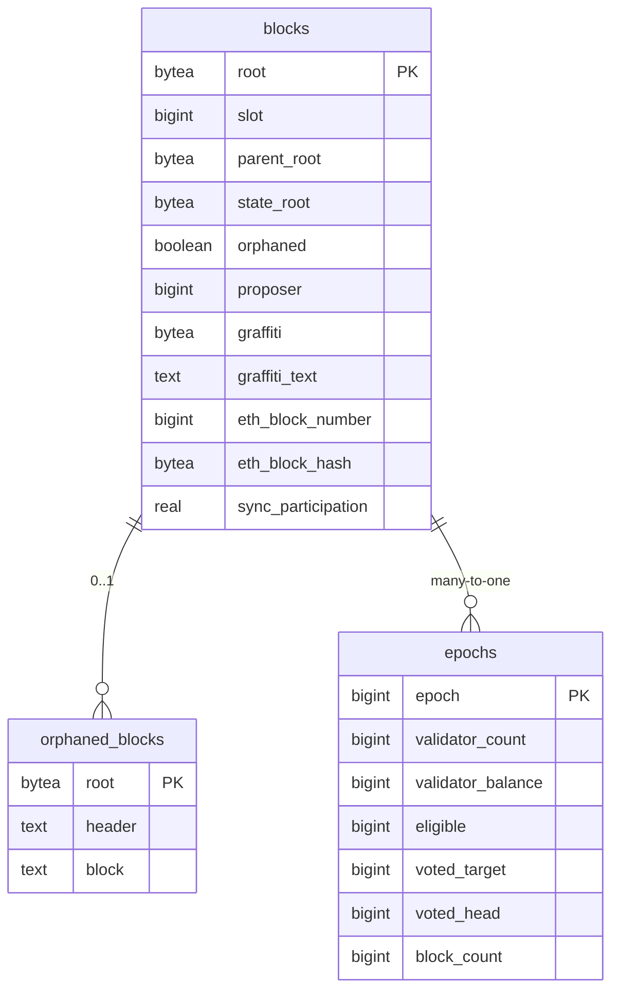
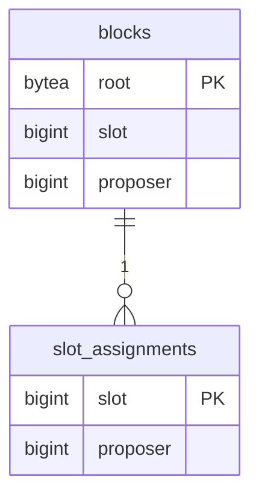
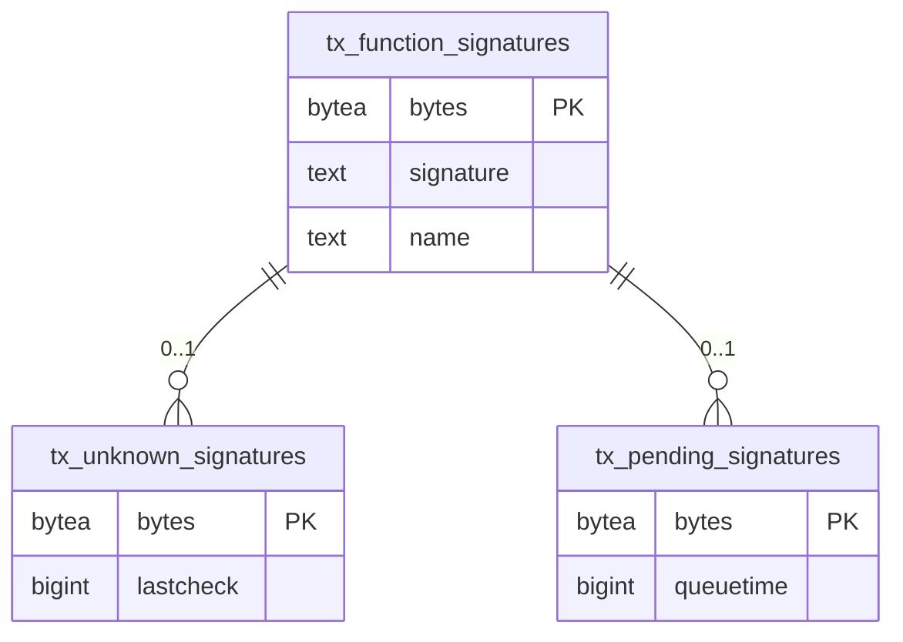
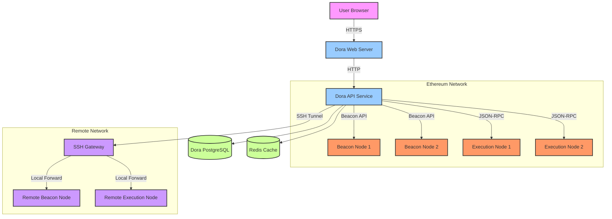

# Dora Block Explorer - TOGAF Architecture Documentation

## 1. Architecture Vision

### 1.1 Business Context
Dora is a lightweight Ethereum Beacon Chain explorer that provides real-time insights into blockchain data without requiring expensive proprietary databases. It's designed to be resource-efficient while offering comprehensive blockchain exploration capabilities.

#### 1.1.1 Open Source Block Explorer Landscape

Dora exists in a competitive landscape of open-source blockchain explorers, each with its own strengths and focus areas. Below is a comparison of major open-source Ethereum block explorers:

| Feature | Dora | Blockscout | Beaconcha.in | Otterscan | Etherscan (Reference) |
|---------|------|------------|--------------|-----------|----------------------|
| **Focus** | Beacon Chain | General EVM | Beacon Chain | Execution Layer | General EVM |
| **License** | GPL-3.0 | Apache-2.0 | Apache-2.0 | MIT | Proprietary |
| **Database** | PostgreSQL/SQLite | PostgreSQL | TimescaleDB | Erigon DB | Proprietary |
| **Resource Usage** | Low | High | Medium | Low | High |
| **Deployment** | Single binary | Container-based | Container-based | Single binary | Cloud-based |
| **Key Features** | - Lightweight<br>- Real-time data<br>- Multiple networks | - Full EVM support<br>- Token explorer<br>- Smart contract verification | - Validator monitoring<br>- Beacon chain analytics<br>- Grafana integration | - Fast local search<br>- Transaction tracing<br>- Lightweight | - Comprehensive analytics<br>- Token tracking<br>- API services |
| **Ideal For** | Beacon chain analysis | General EVM chains | Staking services | Local development | Enterprise users |
| **Self-hosting** | Easy | Complex | Moderate | Very easy | Not possible |

#### 1.1.2 Dora's Unique Value Proposition

Dora differentiates itself by:
1. **Lightweight Design**: Optimized for minimal resource usage while maintaining comprehensive Beacon Chain functionality
2. **Multi-network Support**: Built-in support for multiple Ethereum testnets and mainnet
3. **Developer Focus**: Easy to deploy and extend, with a clean codebase
4. **Real-time Data**: Efficient subscription-based updates for real-time blockchain data
5. **No Proprietary Dependencies**: Operates without requiring expensive proprietary databases or services

### 1.2 Stakeholders
- **End Users**: Blockchain developers, validators, researchers, and enthusiasts
- **Maintainers**: System administrators and DevOps teams
- **Contributors**: Open-source developers
- **Node Operators**: Ethereum node operators

### 1.3 Architecture Requirements
- **Functional Requirements**:
  - Real-time blockchain data visualization
  - Support for multiple Ethereum networks
  - Efficient data caching and retrieval
  - RESTful API for programmatic access
  - Web-based user interface

- **Non-Functional Requirements**:
  - High performance with low resource usage
  - Scalability to handle blockchain growth
  - Extensible architecture for future features
  - Secure data handling

## 2. Business Architecture

### 2.1 Business Processes
1. **Blockchain Data Ingestion**
   - Connect to Ethereum Beacon Chain nodes
   - Subscribe to blockchain events
   - Process and index block data

2. **Data Presentation**
   - Web interface for user interaction
   - API endpoints for programmatic access
   - Data visualization components

3. **System Administration**
   - Configuration management
   - Performance monitoring
   - Logging and debugging

## 3. Information Systems Architecture

### 3.1 Data Architecture

#### 3.1.1 Data Dictionary

##### ER Diagram

The database schema is organized into three main sections: Block Chain Data, Validator Data, and Transaction Processing.

###### 1. Block Chain Data


###### 2. Validator Data


###### 3. Transaction Processing


##### Core Tables

**blocks**
- **Description**: Stores block data from the Ethereum Beacon Chain
- **Primary Key**: `root` (bytea)
- **Key Fields**:
  - `slot`: Block slot number (bigint)
  - `parent_root`: Parent block root (bytea)
  - `state_root`: Beacon state root (bytea)
  - `proposer`: Validator index of block proposer (bigint)
  - `graffiti`: Block graffiti data (bytea)
  - `graffiti_text`: Human-readable graffiti (text, indexed)
  - `orphaned`: Whether block is orphaned (boolean)
  - `eth_block_number`: Linked Ethereum block number (bigint)
  - `eth_block_hash`: Linked Ethereum block hash (bytea)
  - `sync_participation`: Sync committee participation rate (real)

**epochs**
- **Description**: Aggregated epoch statistics
- **Primary Key**: `epoch` (bigint)
- **Key Fields**:
  - `validator_count`: Number of active validators
  - `validator_balance`: Total validator balance
  - `eligible`: Number of eligible validators
  - `voted_target`: Validators that voted for target
  - `voted_head`: Validators that voted for head
  - `block_count`: Number of blocks in epoch
  - Various count metrics (attestations, deposits, exits, etc.)

**slot_assignments**
- **Description**: Maps slots to their assigned proposers
- **Primary Key**: `slot` (bigint)
- **Fields**:
  - `proposer`: Validator index assigned to propose (bigint)

**orphaned_blocks**
- **Description**: Stores data for orphaned blocks
- **Primary Key**: `root` (bytea)
- **Fields**:
  - `header`: Block header data (text)
  - `block`: Full block data (text)

##### Transaction Processing

**tx_function_signatures**
- **Description**: Known function signatures for transaction decoding
- **Primary Key**: `bytes` (bytea)
- **Fields**:
  - `signature`: Function signature (text)
  - `name`: Human-readable function name (text)

**tx_unknown_signatures**
- **Description**: Unknown function signatures for later processing
- **Primary Key**: `bytes` (bytea)
- **Fields**:
  - `lastcheck`: Timestamp of last check (bigint)

**tx_pending_signatures**
- **Description**: Signatures pending processing
- **Primary Key**: `bytes` (bytea)
- **Fields**:
  - `queuetime`: When the signature was queued (bigint)

##### Indexes
- Blocks table has indexes on:
  - `slot` (for time-based queries)
  - `proposer` (for validator analysis)
  - `parent_root` and `state_root` (for chain traversal)
  - `eth_block_number` and `eth_block_hash` (for execution layer linking)
  - `graffiti_text` (with trigram index for text search)

#### 3.1.2 Data Storage
- **Primary Database**: PostgreSQL (with SQLite fallback)
  - Utilizes PostgreSQL's advanced features including:
    - Trigram indexes for efficient text search
    - Binary data storage for hashes and signatures
    - Transaction support for data consistency

- **Caching Layer**: Redis (optional)
  - Used for:
    - Frequently accessed block data
    - Temporary storage of pending operations
    - Rate limiting and API response caching

- **In-Memory Cache**:
  - Hot data caching for low-latency access
  - Batch processing queues
  - Temporary state for real-time operations

### 3.2 Application Architecture

#### 3.2.1 Core Components
1. **Beacon Node Client**
   - Handles communication with Ethereum nodes
   - Implements consensus layer protocols

2. **Indexer Service**
   - Processes and indexes blockchain data
   - Maintains database consistency

3. **API Server**
   - RESTful endpoints for data access
   - Implements rate limiting and authentication

4. **Frontend**
   - Web-based user interface
   - Real-time data visualization

## 4. Technology Architecture

### 4.1 Infrastructure
- **Runtime**: Go (Golang)
- **Web Framework**: Gorilla Mux
- **Database**: PostgreSQL/SQLite
- **Caching**: Redis (optional)
- **Containerization**: Docker support

### 4.2 Deployment Architecture
```
[Ethereum Nodes] ←→ [Dora Explorer] ←→ [Web Browser/API Clients]
    ↑                    ↑
    |                    |
    └── [Database] ←─────┘
```
Deployment Architecture

Dora's architecture is designed to be highly available and fault-tolerant when interacting with Ethereum nodes. It supports connections to both Consensus Layer (CL) and Execution Layer (EL) clients, with built-in failover capabilities.

#### 4.2.1 Node Client Integration and Data Flow

Dora maintains connections to multiple Ethereum node clients for data retrieval and processing:

1. **Consensus Layer (CL) Clients**
   - **Supported Clients**: Lighthouse, Prysm, Teku, Nimbus, Lodestar
   - **Connection Protocol**: HTTP/HTTPS with Keep-Alive
   - **Authentication**: JWT tokens (if required by the client)
   - **Primary Use Cases**:
     - Beacon chain data synchronization
     - Validator monitoring
     - Finality and justification tracking
     - Committee and attestation data
   - **Endpoint Groups**:
     - `beacon`: Core beacon chain data
     - `node`: Node health and version information
     - `config`: Network configuration
     - `debug`: Debug and monitoring endpoints
     - `events`: Real-time event subscriptions
     - `validator`: Validator operations and duties

2. **Execution Layer (EL) Clients**
   - **Supported Clients**: Geth, Nethermind, Erigon, Besu
   - **Connection Protocol**: HTTP/HTTPS and WebSocket
   - **Authentication**: API keys or JWT tokens
   - **Primary Use Cases**:
     - Transaction pool monitoring
     - Smart contract interactions
     - Account and balance lookups
     - Block and transaction tracing
   - **Endpoint Groups**:
     - `eth`: Core Ethereum JSON-RPC methods
     - `net`: Network information
     - `web3`: Web3 client information
     - `debug`: Execution layer debugging
     - `txpool`: Transaction pool inspection
     - `trace`: Transaction tracing (if supported)

3. **Database Integration**
   - **Primary Database**: PostgreSQL
     - Used for storing indexed blockchain data
     - Connection pool configuration optimized for read-heavy workload
     - Regular vacuum and analyze jobs for performance
   - **Cache Layer**: Redis
     - Caches frequently accessed data
     - Implements TTL for cache invalidation
     - Connection pooling for high throughput
   - **Connection Management**:
     - Connection pooling for both read and write operations
     - Configurable timeouts and retry policies
     - Automatic reconnection on failure

#### 4.2.2 Detailed RPC Endpoint Usage

Dora's interaction with Ethereum nodes is comprehensive and covers the following endpoints:

**Consensus Layer (Beacon Node) Endpoints:**

1. **Beacon API (`/eth/v1/beacon`)**
   - `GET /beacon/headers/{block_id}` - Retrieve block headers
   - `GET /beacon/blocks/{block_id}` - Get full block data
   - `GET /beacon/states/{state_id}/validators` - Validator information
   - `GET /beacon/states/{state_id}/committees` - Committee data
   - `GET /beacon/pool/attestations` - Pending attestations
   - `GET /beacon/pool/attester_slashings` - Pending attester slashings
   - `GET /beacon/pool/proposer_slashings` - Pending proposer slashings
   - `GET /beacon/pool/voluntary_exits` - Pending voluntary exits

2. **Node API (`/eth/v1/node`)**
   - `GET /node/version` - Client version information
   - `GET /node/syncing` - Synchronization status
   - `GET /node/identity` - Node identity information
   - `GET /node/peers` - Connected peers
   - `GET /node/peer_count` - Number of connected peers

3. **Config API (`/eth/v1/config`)**
   - `GET /config/spec` - Chain specification
   - `GET /config/fork_schedule` - Fork schedule
   - `GET /config/deposit_contract` - Deposit contract information

4. **Debug API (`/eth/v1/debug`)**
   - `GET /debug/beacon/states/{state_id}` - Full state dump
   - `GET /debug/beacon/heads` - Current chain heads

5. **Events API (`/eth/v1/events`)**
   - `GET /events` - SSE stream of events
   - Event types: head, block, attestation, voluntary_exit, finalized_checkpoint, chain_reorg

6. **Validator API (`/eth/v1/validator`)**
   - `GET /validator/duties/proposer/{epoch}` - Proposer duties
   - `GET /validator/duties/attester/{epoch}` - Attestation duties
   - `POST /validator/beacon_committees/subscriptions` - Subscribe to committees

**Execution Layer Endpoints:**

1. **Ethereum API (`eth_*`)**
   - `eth_getBlockByNumber` - Get block by number
   - `eth_getBlockByHash` - Get block by hash
   - `eth_getTransactionReceipt` - Transaction receipts
   - `eth_call` - Execute message call
   - `eth_getLogs` - Get event logs
   - `eth_getBalance` - Get account balance
   - `eth_getCode` - Get contract code
   - `eth_getStorageAt` - Get storage at position

2. **Net API (`net_*`)**
   - `net_version` - Network ID
   - `net_listening` - Whether client is listening
   - `net_peerCount` - Number of peers

3. **Web3 API (`web3_*`)**
   - `web3_clientVersion` - Client version
   - `web3_sha3` - Keccak-256 hash

4. **Debug API (`debug_*`)**
   - `debug_traceTransaction` - Trace transaction execution
   - `debug_traceBlockByNumber` - Trace all transactions in block
   - `debug_traceBlockByHash` - Trace all transactions in block

5. **TxPool API (`txpool_*`)**
   - `txpool_status` - Transaction pool status
   - `txpool_content` - Pending transactions
   - `txpool_inspect` - Inspect transaction pool

6. **Trace API (`trace_*`)**
   - `trace_block` - All traces in block
   - `trace_transaction` - All traces in transaction
   - `trace_call` - Execute and trace call

#### 4.2.3 Connection Management and Configuration

Dora implements a robust connection management system with the following features:

1. **Connection Pooling**
   - **HTTP/HTTPS Connections**:
     - Maximum connections per host: 100
     - Idle connection timeout: 30 seconds
     - Keep-alive duration: 60 seconds
     - Connection timeout: 10 seconds
     - Response timeout: 30 seconds
   - **WebSocket Connections**:
     - Auto-reconnect with exponential backoff
     - Ping-pong mechanism for connection health
     - Message size limit: 10MB
   - **Database Connections**:
     - PostgreSQL connection pool: 5-50 connections
     - Redis connection pool: 10-100 connections
     - Connection lifetime: 1 hour
     - Idle timeout: 5 minutes

2. **Load Balancing**
   - **Round-Robin Strategy**:
     - Even distribution of requests across available nodes
     - Weighted routing based on node performance
     - Sticky sessions for stateful operations
   - **Priority-Based Routing**:
     - Primary nodes handle all read/write operations
     - Secondary nodes handle read replicas
     - Fallback nodes for critical operations
   - **Request Batching**:
     - Batch size limit: 100 requests
     - Batch timeout: 100ms
     - Parallel execution of non-dependent requests

3. **Failover and Health Monitoring**
   - **Health Checks**:
     - Endpoint: `/-/health`
     - Check interval: 10 seconds
     - Unhealthy threshold: 3 consecutive failures
   - **Circuit Breaker**:
     - Failure threshold: 50%
     - Reset timeout: 30 seconds
     - Half-open state timeout: 10 seconds
   - **Node Selection**:
     - Latency-based selection
     - Error rate monitoring
     - Success rate tracking

4. **Security and Authentication**
   - **TLS Configuration**:
     - Minimum TLS version: 1.2
     - Cipher suite preferences
     - Certificate pinning
   - **Authentication Methods**:
     - JWT tokens for Beacon Node API
     - API keys for Execution Client
     - Basic Auth for admin endpoints
   - **Rate Limiting**:
     - Requests per second: 1000
     - Burst size: 100
     - IP-based rate limiting

5. **Monitoring and Logging**
   - **Metrics**:
     - Request latency
     - Error rates
     - Connection pool status
     - Cache hit/miss ratio
   - **Logging**:
     - Structured JSON logging
     - Correlation IDs for request tracing
     - Log levels: debug, info, warn, error

6. **SSH Tunneling**
   - **Tunnel Configuration**:
     - Local port forwarding
     - Remote port forwarding
     - Dynamic port forwarding
   - **Authentication**:
     - Public key authentication (preferred)
     - Password authentication
     - Agent forwarding
   - **Reconnection**:
     - Automatic reconnection on failure
     - Backoff strategy: exponential, max 1 minute
     - Maximum retry attempts: 10

#### 1.1.4 Configuration

Dora's node configuration is highly configurable:

```yaml
# Beacon Node Configuration
beacon_api:
  # beacon node rpc endpoints
  endpoints:
    - name: "primary-beacon"
      url: "http://localhost:5052"
      headers: {}
      priority: 1
      archive: false
      skip_validators: false
    - name: "backup-beacon"
      url: "https://backup-beacon.example.com"
      headers:
        Authorization: "Bearer API_KEY"
      priority: 2
      archive: true

# Execution Node Configuration
execution_api:
  # execution node rpc endpoints
  endpoints:
    - name: "primary-execution"
      url: "http://localhost:8545"
      headers: {}
      priority: 1
    - name: "backup-execution"
      url: "https://backup-execution.example.com"
      headers:
        Authorization: "Bearer API_KEY"
      priority: 2

# SSH Tunnel Configuration (optional)
ssh_tunnels:
  - name: "remote-node-tunnel"
    host: "remote-host.example.com"
    port: 22
    user: "ssh-user"
    keyfile: "/path/to/ssh/key"
    # OR password: "ssh-password"
    local_port: 8546
    remote_host: "localhost"
    remote_port: 8545
```

#### 1.1.5 Security Considerations

- **Authentication**: Supports JWT tokens and API keys for node authentication
- **Encryption**: All external communications use TLS/SSL
- **Rate Limiting**: Implements request rate limiting to prevent overloading nodes
- **SSH Security**: Uses strong encryption and key-based authentication for SSH tunnels
- **Header Injection**: Allows custom headers for authentication and identification

#### 1.1.6 Deployment Diagram

The following diagram illustrates a typical Dora deployment from an operating system perspective:



**Key Components**:

1. **User Facing**:
   - Users interact with Dora through a web browser
   - HTTPS traffic is terminated at the Dora web server

2. **Dora Services**:
   - **Web Server**: Serves the frontend and handles API requests
   - **API Service**: Processes all blockchain data requests
   - **PostgreSQL**: Primary database for storing indexed blockchain data
   - **Redis**: Caching layer for improved performance

3. **Ethereum Node Connections**:
   - **Primary/Backup Beacon Nodes**: For consensus layer data
   - **Primary/Backup Execution Nodes**: For execution layer data
   - Connections support automatic failover and load balancing

4. **Remote Access (Optional)**:
   - Secure SSH tunneling for accessing nodes in private networks
   - Supports both password and key-based authentication
   - Automatic reconnection on tunnel failure

This deployment architecture ensures high availability, fault tolerance, and secure access to blockchain data while maintaining good performance through caching and connection pooling.


### 4.3 Security Architecture
- Rate limiting for API endpoints
- Input validation and sanitization
- Secure database access
- Regular security updates

## 5. Implementation and Migration

### 5.1 Implementation Roadmap
1. **Phase 1: Core Infrastructure**
   - Database schema implementation
   - Basic blockchain data ingestion
   - Essential API endpoints

2. **Phase 2: Core Features**
   - Block and transaction exploration
   - Validator monitoring
   - Basic search functionality

3. **Phase 3: Enhanced Features**
   - Advanced analytics
   - Customizable dashboards
   - API documentation

### 5.2 Migration Strategy
- Support for both SQLite and PostgreSQL
- Database migration scripts
- Configuration management

## 6. Governance

### 6.1 Development Process
- Open-source development model
- GitHub-based issue tracking
- Pull request review process

### 6.2 Release Management
- Semantic versioning
- Release notes and changelog
- Backward compatibility

## 7. Standards and Guidelines

### 7.1 Coding Standards
- Go code formatting with gofmt
- Linting with golangci-lint
- Comprehensive test coverage

### 7.2 Documentation
- Inline code documentation
- API documentation
- User guides
- Deployment guides

## 8. Future Considerations

### 8.1 Scalability
- Horizontal scaling for API servers
- Database sharding
- Caching strategies

### 8.2 Feature Roadmap
- Support for additional Ethereum networks
- Enhanced analytics capabilities
- Mobile application support
- Advanced search functionality
