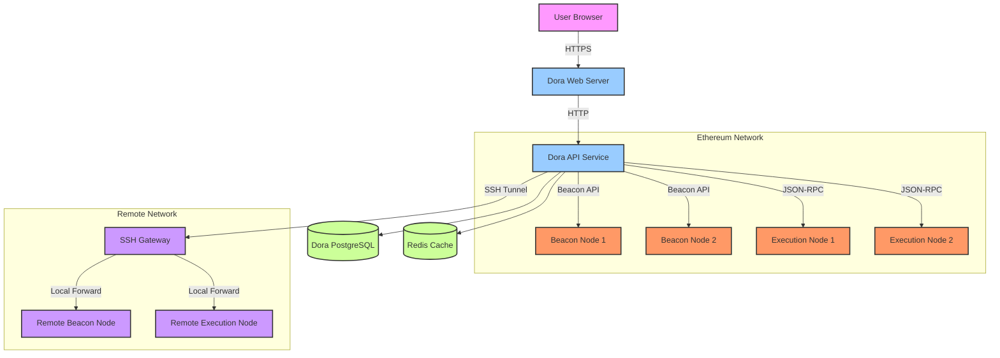

# Dora Block Explorer - Architecture Documentation

## Table of Contents
1. [Deployment Architecture](#1-deployment-architecture)
   - [Node Client Integration](#11-node-client-integration)
   - [RPC Endpoints and API Groups](#12-rpc-endpoints-and-api-groups)
   - [Connection Management](#13-connection-management)
   - [Configuration](#14-configuration)
   - [Security Considerations](#15-security-considerations)
   - [Deployment Diagram](#16-deployment-diagram)
2. [Business Context](#2-business-context)
   - [Open Source Block Explorer Landscape](#21-open-source-block-explorer-landscape)
   - [Dora's Unique Value Proposition](#22-doras-unique-value-proposition)
3. [Technical Architecture](#3-technical-architecture)
   - [System Components](#31-system-components)
   - [Data Flow](#32-data-flow)
4. [Data Architecture](#4-data-architecture)
   - [Database Schema](#41-database-schema)
   - [Data Dictionary](#42-data-dictionary)
   - [Indexing Strategy](#43-indexing-strategy)

## 1. Deployment Architecture

Dora's architecture is designed to be highly available and fault-tolerant when interacting with Ethereum nodes. It supports connections to both Consensus Layer (CL) and Execution Layer (EL) clients, with built-in failover capabilities.

### 1.1 Node Client Integration

Dora connects to Ethereum nodes using the following client types:

1. **Consensus Layer Clients**
   - Connects to Beacon Node clients (e.g., Lighthouse, Prysm, Teku, Nimbus, Lodestar)
   - Uses the standard Ethereum 2.0 Beacon Node API
   - Supports multiple endpoints with failover

2. **Execution Layer Clients**
   - Connects to Execution clients (e.g., Geth, Nethermind, Erigon, Besu)
   - Uses standard JSON-RPC over HTTP/HTTPS
   - Supports WebSocket subscriptions for real-time updates
   - Implements connection pooling for performance

### 1.2 RPC Endpoints and API Groups

Dora interacts with the following RPC endpoint groups:

**Consensus Layer (Beacon Node) Endpoints:**
- `/eth/v1/beacon` - Beacon chain data
- `/eth/v1/node` - Node information and health
- `/eth/v1/config` - Network configuration
- `/eth/v1/debug` - Debug endpoints
- `/eth/v1/events` - Event subscriptions
- `/eth/v1/validator` - Validator operations (optional)

**Execution Layer Endpoints:**
- `eth_*` - Standard Ethereum JSON-RPC methods
- `net_*` - Network information
- `web3_*` - Web3 client information
- `debug_*` - Debug trace endpoints (if enabled)
- `txpool_*` - Transaction pool inspection

### 1.3 Connection Management

Dora implements sophisticated connection handling:

1. **Connection Pooling**
   - Maintains persistent connections to nodes
   - Implements connection reuse for performance
   - Handles reconnection on failure

2. **Load Balancing**
   - Distributes requests across available nodes
   - Implements round-robin strategy for load distribution
   - Supports priority-based routing

3. **Failover**
   - Automatic failover to backup nodes
   - Health checks and node status monitoring
   - Circuit breaker pattern to handle unresponsive nodes

4. **SSH Tunneling**
   - Secure remote node access via SSH tunneling
   - Supports both password and key-based authentication
   - Automatic tunnel management and reconnection

### 1.4 Configuration

Dora's node configuration is highly configurable:

```yaml
# Beacon Node Configuration
beacon_api:
  # beacon node rpc endpoints
  endpoints:
    - name: "primary-beacon"
      url: "http://localhost:5052"
      headers: {}
      priority: 1
      archive: false
      skip_validators: false
    - name: "backup-beacon"
      url: "https://backup-beacon.example.com"
      headers:
        Authorization: "Bearer API_KEY"
      priority: 2
      archive: true

# Execution Node Configuration
execution_api:
  # execution node rpc endpoints
  endpoints:
    - name: "primary-execution"
      url: "http://localhost:8545"
      headers: {}
      priority: 1
    - name: "backup-execution"
      url: "https://backup-execution.example.com"
      headers:
        Authorization: "Bearer API_KEY"
      priority: 2

# SSH Tunnel Configuration (optional)
ssh_tunnels:
  - name: "remote-node-tunnel"
    host: "remote-host.example.com"
    port: 22
    user: "ssh-user"
    keyfile: "/path/to/ssh/key"
    # OR password: "ssh-password"
    local_port: 8546
    remote_host: "localhost"
    remote_port: 8545
```

### 1.5 Security Considerations

- **Authentication**: Supports JWT tokens and API keys for node authentication
- **Encryption**: All external communications use TLS/SSL
- **Rate Limiting**: Implements request rate limiting to prevent overloading nodes
- **SSH Security**: Uses strong encryption and key-based authentication for SSH tunnels
- **Header Injection**: Allows custom headers for authentication and identification

### 1.6 Deployment Diagram

The following diagram illustrates a typical Dora deployment from an operating system perspective:



**Key Components**:

1. **User Facing**:
   - Users interact with Dora through a web browser
   - HTTPS traffic is terminated at the Dora web server

2. **Dora Services**:
   - **Web Server**: Serves the frontend and handles API requests
   - **API Service**: Processes all blockchain data requests
   - **PostgreSQL**: Primary database for storing indexed blockchain data
   - **Redis**: Caching layer for improved performance

3. **Ethereum Node Connections**:
   - **Primary/Backup Beacon Nodes**: For consensus layer data
   - **Primary/Backup Execution Nodes**: For execution layer data
   - Connections support automatic failover and load balancing

4. **Remote Access (Optional)**:
   - Secure SSH tunneling for accessing nodes in private networks
   - Supports both password and key-based authentication
   - Automatic reconnection on tunnel failure

## 2. Business Context

Dora is a lightweight Ethereum Beacon Chain explorer that provides real-time insights into blockchain data without requiring expensive proprietary databases. It's designed to be resource-efficient while offering comprehensive blockchain exploration capabilities.

### 2.1 Open Source Block Explorer Landscape

Dora exists in a competitive landscape of open-source blockchain explorers, each with its own strengths and focus areas. Below is a comparison of major open-source Ethereum block explorers:

| Feature | Dora | Blockscout | Beaconcha.in | Otterscan | Etherscan (Reference) |
|---------|------|------------|--------------|-----------|----------------------|
| **Focus** | Beacon Chain | General EVM | Beacon Chain | Execution Layer | General EVM |
| **License** | GPL-3.0 | Apache-2.0 | Apache-2.0 | MIT | Proprietary |
| **Database** | PostgreSQL/SQLite | PostgreSQL | TimescaleDB | Erigon DB | Proprietary |
| **Resource Usage** | Low | High | Medium | Low | High |
| **Deployment** | Single binary | Container-based | Container-based | Single binary | Cloud-based |
| **Key Features** | - Lightweight<br>- Real-time data<br>- Multiple networks | - Full EVM support<br>- Token explorer<br>- Smart contract verification | - Validator monitoring<br>- Beacon chain analytics<br>- Grafana integration | - Fast local search<br>- Transaction tracing<br>- Lightweight | - Comprehensive analytics<br>- Token tracking<br>- API services |
| **Ideal For** | Beacon chain analysis | General EVM chains | Staking services | Local development | Enterprise users |
| **Self-hosting** | Easy | Complex | Moderate | Very easy | Not possible |

### 2.2 Dora's Unique Value Proposition

Dora differentiates itself by:
- **Lightweight Design**: Minimal resource requirements while maintaining performance
- **Real-time Data**: Live updates without page refreshes
- **Multi-Client Support**: Works with any standard Ethereum client
- **Easy Deployment**: Single-binary deployment with minimal dependencies
- **Open Source**: Full transparency and community-driven development

## 3. Technical Architecture

### 3.1 System Components

Dora is built using the following core technologies:

- **Backend**: Go (Golang)
- **Frontend**: JavaScript/TypeScript, React
- **Database**: PostgreSQL (primary), Redis (caching)
- **API**: RESTful API with WebSocket support
- **Containerization**: Docker support for easy deployment

### 3.2 Data Flow

1. **Data Ingestion**:
   - Fetches data from Ethereum nodes via RPC/HTTP
   - Processes and normalizes the data
   - Stores in PostgreSQL database

2. **API Layer**:
   - Serves processed data to the frontend
   - Implements caching with Redis
   - Handles authentication and rate limiting

3. **Frontend**:
   - Interactive UI built with React
   - Real-time updates via WebSocket
   - Responsive design for all device types

## 4. Data Architecture

### 4.1 Database Schema

The database schema is designed for efficient querying of blockchain data. Key tables include:

- `blocks`: Core blockchain data
- `transactions`: Transaction details
- `accounts`: Account balances and states
- `validators`: Validator information and performance
- `events`: Smart contract events

### 4.2 Data Dictionary

#### Blocks Table
- `block_number`: The block number
- `block_hash`: Hash of the block
- `timestamp`: Block creation time
- `miner`: Address of the miner
- `size`: Block size in bytes
- `gas_used`: Total gas used
- `gas_limit`: Gas limit for the block

#### Transactions Table
- `tx_hash`: Transaction hash
- `block_number`: Reference to containing block
- `from_address`: Sender address
- `to_address`: Recipient address
- `value`: Transaction value in wei
- `gas_price`: Gas price in wei
- `input_data`: Input data for contract calls

### 4.3 Indexing Strategy

Dora employs several indexing strategies to ensure optimal query performance:

- **Primary Keys**: All tables have appropriate primary keys
- **Foreign Keys**: Relationships between tables are properly indexed
- **Composite Indexes**: For common query patterns
- **Partial Indexes**: For frequently filtered columns
- **Materialized Views**: For expensive aggregations

Indexes are regularly maintained and optimized based on query patterns and performance metrics.
