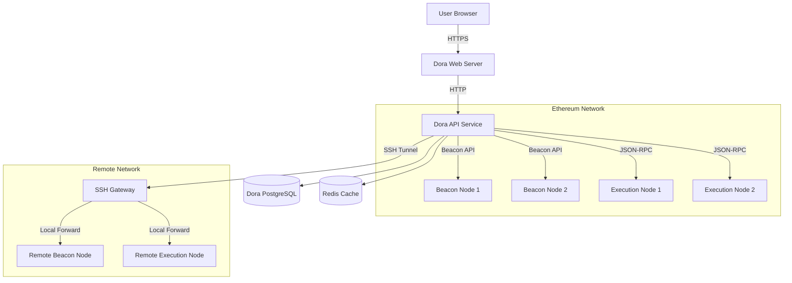

# Deployment Architecture

## Overview

Dora's deployment architecture is designed for high availability, scalability, and fault tolerance. This document outlines the key components and their interactions.

## Architecture Diagram

## Components

### 1. Dora Services

- **Web Server**: Serves the frontend and handles API requests
- **API Service**: Processes all blockchain data requests
- **PostgreSQL**: Primary database for storing indexed blockchain data
- **Redis**: Caching layer for improved performance

### 2. Ethereum Node Connections

- **Beacon Nodes**: For consensus layer data
- **Execution Nodes**: For execution layer data
- **Failover Support**: Automatic failover between nodes
- **Load Balancing**: Distributes requests across available nodes

### 3. Remote Access (Optional)

- **SSH Tunneling**: Secure access to nodes in private networks
- **Authentication**: Supports both password and key-based authentication
- **Automatic Reconnection**: Handles tunnel failures gracefully

## Configuration

See the [Configuration Guide](../Getting-Started/Configuration) for details on setting up the deployment.

## High Availability

- Multiple node connections with automatic failover
- Connection pooling and reuse
- Health checks and monitoring
- Circuit breaker pattern for unresponsive nodes

## Security Considerations

- All external communications use TLS/SSL
- Rate limiting to prevent abuse
- Secure storage of credentials using environment variables
- Regular security updates and patches

## Monitoring

- Prometheus metrics endpoint
- Health check endpoints
- Log aggregation
- Alerting for critical issues

## Scaling

- Stateless API services for horizontal scaling
- Database read replicas for read-heavy workloads
- Caching layer to reduce database load
- Connection pooling for efficient resource usage
